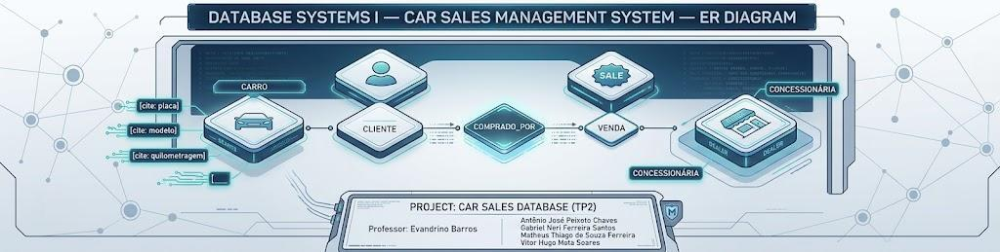
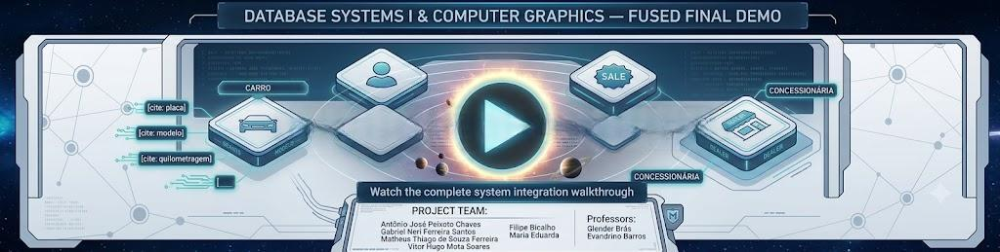

# Car Sales Management System 🚗💼

A robust database-driven web application designed to manage automotive inventory, sales pipelines, and customer relations. This project was developed as the final practical evaluation for the **Database Systems I** course in the Computer Engineering curriculum at CEFET-MG.

---

## 👥 Authorship & Faculty

* **Professor:** Evandrino Barros
* **Development Team:**
  * Antônio José Peixoto Chaves
  * Gabriel Neri Ferreira Santos
  * Matheus Thiago de Souza Ferreira
  * Vitor Hugo Mota Soares

---

## 🛠️ System Architecture & Database Design

* **Architectural Pattern:** Built strictly upon the **Model-View-Controller (MVC)** software architecture pattern to ensure clean separation of concerns.
* **Data Access Layer:** Developed intentionally **without an ORM** (Object-Relational Mapping). All database interactions, transactions, and queries are executed using native, raw **SQL sentences** to maximize query optimization and showcase database fundamentals.

### Entity-Relationship Diagram (ERD)
The underlying relational database schema balances normalization and data integrity. Below is the conceptual design:

<div align="center">
  <a href="./diagrama_er/diagrama_er.png" target="_blank">
    
  </a>
</div>

---

## 🚀 Execution & Local Deployment

The entire environment is fully containerized to minimize host machine setup and avoid dependency drifting.

### 1. Prerequisites
Ensure you have [Docker & Docker Compose](https://www.docker.com/) installed and running on your system.

### 2. Launching the Containers
Open your terminal environment at the root directory of the repository and execute the orchestration build command:
```bash
docker-compose up --build
```

### 3. Verification
Wait for the initialization logs to stabilize. Once the database migrations are executed and the containers are fully active, the application services will be exposed locally.

## 🌐 Application Gateway (Local Access Links)
Once your local Docker containers are fully up and running, you can access the system boundaries via the following endpoints:

Front-End User Interface: Available at http://localhost:3000

Back-End API Documentation: Interactive Swagger/OpenAPI documentation can be audited at http://localhost:8000/docs

## 🎥 Project Demonstration
For a comprehensive walkthrough of the system functionalities, database constraints, and engineering implementation, watch our video presentation:

<div align="center">
  <a href="https://www.youtube.com/watch?v=qm-bWm7iEi0" target="_blank">
    
  </a>
</div>
